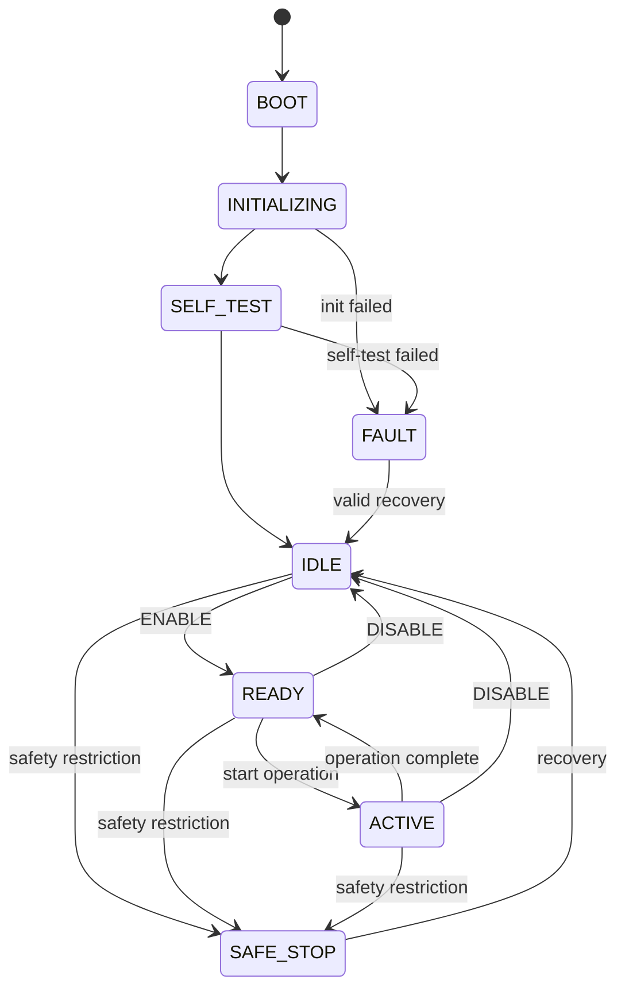

# SYSTEM_STATE_MACHINE.md

**AUTOCHAIR · EMBEDDED FIRMWARE · V1.0**

**Project:** AutoChair – AI-Powered Smart Wheelchair
**Company:** Aivon Innovations Pvt. Ltd.
**Platform:** ESP32-WROOM-32D
**Status:** Architecture specification
**Dependencies:** `ESP32_CONTROLLER_PRD.md`, `ESP32_ARCHITECTURE.md`

---

## 1. Purpose

The System State Machine defines how the AutoChair ESP32 transitions between operational states, processes commands, responds to faults, and enforces safety restrictions.

It must provide:

- Deterministic state transitions.
- Centralized control of operating modes.
- Explicit command permissions.
- Fault detection and recovery.
- Emergency-stop handling.
- Communication-loss handling.
- Safe startup and initialization.

**Core principle:** No command, operating mode, or subsystem may bypass the state machine or Safety Manager.

This document specifies the intended firmware behavior. It does not establish that the physical wheelchair can currently be controlled or stopped electronically by the ESP32.

---

## 2. State Architecture

The system uses three related but separate state dimensions.

| Dimension      | Purpose                                              |
| -------------- | ---------------------------------------------------- |
| System state   | Overall firmware lifecycle and operational readiness |
| Operating mode | Selected method of operation                         |
| Safety state   | Whether safety conditions permit continued operation |

These dimensions must not be combined into one large enumeration.

For example, the ESP32 may be in `READY`, have `MANUAL` selected, and simultaneously report `SAFE` because the emergency-stop input is active.

### 2.1 System states

```cpp
enum class SystemState {
    BOOT,
    INITIALIZING,
    SELF_TEST,
    IDLE,
    READY,
    ACTIVE,
    SAFE_STOP,
    FAULT
};
```

### 2.2 Operating modes

```cpp
enum class OperatingMode {
    NONE,
    MANUAL,
    ASSISTED
};
```

`MANUAL` and `ASSISTED` are selected modes, not independent system lifecycle states.

### 2.3 Safety states

```cpp
enum class SafetyState {
    CLEAR,
    SAFE
};
```

`CLEAR` means that all currently configured safety conditions have passed. It does not mean that the wheelchair is certified safe or that movement is authorized.

`SAFE` means a safety restriction is active. The system must reject operations that are not permitted under that restriction.

---

## 3. Overall State Diagram

Conceptual lifecycle. Transition guards and fault handling are defined below; arrows do not imply automatic transitions.



*Any state → `FAULT` on a blocking fault (not all arrows drawn for readability).*

---

## 4. State Definitions

### 4.1 `BOOT`

**Startup**

The ESP32 has powered on or restarted. The firmware has not yet established operational readiness.

**Entry actions:** Establish initial software defaults, set all application-controlled outputs to their configured inactive states, and initialize the minimum facilities needed for startup.

**Allowed transition:** `BOOT → INITIALIZING` once the initial runtime is ready.

**Restrictions:** Reject operational and movement-related commands. No previous enable authorization may survive a reboot.

### 4.2 `INITIALIZING`

**Startup**

The ESP32 initializes its configured modules.

Initialization includes the state machine, communication, sensor drivers, safety inputs, diagnostics, and watchdog configuration.

**Successful transition:** `INITIALIZING → SELF_TEST`.

**Failure transition:** `INITIALIZING → FAULT` when a required module cannot initialize. An explicitly optional module may instead be marked unavailable under the configured degradation policy.

### 4.3 `SELF_TEST`

**Verification**

The ESP32 checks the availability and basic health of required subsystems.

| Check                          | Expected result     |
| ------------------------------ | ------------------- |
| Firmware configuration         | Valid               |
| Required sensor initialization | Successful          |
| Safety-input initialization    | Successful          |
| Emergency-stop status          | Readable            |
| Communication subsystem        | Initialized         |
| Watchdog                       | Configured          |
| Internal diagnostics           | No blocking failure |

A self-test must not claim to validate the actual wheelchair braking system, motor controller, or mechanical safety.

**Successful transition:** `SELF_TEST → IDLE`.

**Failure transition:** `SELF_TEST → FAULT` for a blocking failure.

A safety input that is readable but asserted must remain asserted in the Safety Manager; it must not be treated as cleared merely because initialization succeeded.

### 4.4 `IDLE`

**Non-operational**

The firmware is initialized but not enabled.

Sensor acquisition, communication, telemetry, diagnostics, and safety monitoring may continue.

**Allowed commands:** `PING`, `GET_STATUS`, sensor-data requests, permitted mode selection, and `ENABLE` when its guards are satisfied.

**Transition:** `IDLE → READY` only after an accepted `ENABLE` command.

The system must not enter `READY` if safety is `SAFE` or a blocking fault is active.

### 4.5 `READY`

**Enabled**

The ESP32 has accepted enable authorization, all required readiness checks have passed, and an operating mode has been selected.

In V1, `READY` authorizes only the implemented and tested firmware functions. It does not authorize physical wheelchair movement.

**Transitions:**

- `READY → ACTIVE` when a supported operation begins.
- `READY → IDLE` after `DISABLE`.
- `READY → SAFE_STOP` when a safety restriction occurs.

### 4.6 `ACTIVE`

**Operation in progress**

An authorized operation is underway.

For the current prototype, this can mean an implemented bench-test or simulated operation. It must not be interpreted as proof of motor-control integration.

The system continuously evaluates commands, safety conditions, communication health, and faults.

**Transitions:**

- `ACTIVE → READY` when the operation ends.
- `ACTIVE → IDLE` after a valid disable sequence.
- `ACTIVE → SAFE_STOP` when a safety restriction occurs.

### 4.7 `SAFE_STOP`

**Safety restriction**

A safety condition has invalidated the current enable authorization.

**Entry actions:**

1. Revoke enable authorization.
2. Cancel pending operational commands.
3. Reject new operational commands.
4. Record the safety cause.
5. Publish a safety event.
6. Request a stop through the configured, verified interface, if one exists.

For V1, entering `SAFE_STOP` is a firmware state transition. It must not be described as physically stopping the wheelchair until a verified stopping interface has been integrated and tested.

The system continues essential safety monitoring, communication, and diagnostics.

Recovery is governed by [Section 11](#11-recovery-rules).

### 4.8 `FAULT`

**Blocking failure**

A blocking failure prevents normal operation.

Examples include a required subsystem failing initialization, an unrecoverable internal error, or a fault that the configured policy classifies as critical.

**Entry actions:** Revoke enable authorization, cancel operational commands, preserve available fault information, report the failure, and invoke any configured, verified safe-output behavior.

`FAULT` must never automatically transition into `READY` or `ACTIVE`.

---

## 5. Operating-Mode Management

The supported architectural modes are:

| Mode       | Meaning in V1                                          |
| ---------- | ------------------------------------------------------ |
| `NONE`     | No operating mode selected                             |
| `MANUAL`   | Manual-mode selection and associated command routing   |
| `ASSISTED` | Assisted-mode selection and associated command routing |

Selecting a mode does not prove that its physical movement functions have been implemented.

Mode changes are accepted only in `IDLE` or `READY`, with no active operation and no blocking safety condition. A mode change during `ACTIVE` must first terminate the current operation through the defined stop/disable procedure.

Unsupported modes must return `NACK`.

---

## 6. Transition Rules

All transitions must be processed through a single state-management interface.

| Current state      | Event                                     | Guard                                      | Next state     |
| ------------------ | ----------------------------------------- | ------------------------------------------ | -------------- |
| `BOOT`             | Startup complete                          | Runtime initialized                        | `INITIALIZING` |
| `INITIALIZING`     | Initialization complete                   | Required modules initialized               | `SELF_TEST`    |
| `INITIALIZING`     | Initialization failed                     | Blocking failure                           | `FAULT`        |
| `SELF_TEST`        | Self-test passed                          | Required checks passed                     | `IDLE`         |
| `SELF_TEST`        | Self-test failed                          | Blocking failure                           | `FAULT`        |
| `IDLE`             | `ENABLE`                                  | Safety clear, mode valid, readiness passed | `READY`        |
| `READY`            | Start operation                           | Operation supported and authorized         | `ACTIVE`       |
| `ACTIVE`           | Operation complete                        | No safety restriction                      | `READY`        |
| `READY`            | `DISABLE`                                 | Command valid                              | `IDLE`         |
| `ACTIVE`           | `DISABLE`                                 | Valid termination sequence                 | `IDLE`         |
| `READY` / `ACTIVE` | Safety restriction                        | Safety Manager reports `SAFE`              | `SAFE_STOP`    |
| `IDLE`             | Safety restriction                        | Safety Manager reports `SAFE`              | `SAFE_STOP`    |
| `SAFE_STOP`        | Safety condition cleared and acknowledged | Recovery guards passed                     | `IDLE`         |
| Any state          | Blocking fault                            | Fault Manager reports critical fault       | `FAULT`        |
| `FAULT`            | Valid recovery                            | Recovery guards and self-test pass         | `IDLE`         |

`STOP` is a high-priority command. In `READY` or `ACTIVE`, it cancels the current operation and invalidates enable authorization. In the absence of a safety fault, the firmware returns to `IDLE` after the configured stop procedure. If safety is restricted, it remains in `SAFE_STOP` or `FAULT` as appropriate.

---

## 7. Safety Manager Integration

The Safety Manager is independent of operating-mode selection.

The Safety Manager evaluates:

- Emergency-stop status.
- Heartbeat status.
- Command validity.
- Required sensor health.
- Critical firmware faults.
- Watchdog-related conditions.
- System readiness.

A transition to `SAFE` must invalidate operational authorization. A later return to `CLEAR` must not automatically restore that authorization.

---

## 8. Emergency-Stop Behavior

An asserted emergency-stop input takes priority over ordinary commands.

```text
E-stop asserted
       |
       v
SafetyState = SAFE
       |
       v
Revoke enable authorization
       |
       v
Cancel operational commands
       |
       v
SystemState = SAFE_STOP
       |
       v
Report E-stop event
```

The emergency-stop condition must remain latched in the firmware until the physical input is released and the required reset or acknowledgement procedure is completed.

Releasing the input alone must not re-enable the system.

A software-monitored E-stop is not a substitute for an independently verified physical emergency-stop circuit.

---

## 9. Heartbeat and Communication Loss

The ESP32 must track the Raspberry Pi heartbeat.

A heartbeat message updates the communication-health timestamp only after the message has passed protocol validation.

If the configured heartbeat timeout expires while the ESP32 is in `READY` or `ACTIVE`, the Safety Manager must enter `SAFE`, revoke enable authorization, and trigger `SAFE_STOP`.

The same communication-loss condition must be recorded and reported in `IDLE`; its effect on initialization and diagnostics is determined by the configured communication requirements.

**Timeout policy:** The heartbeat interval, timeout, and recovery criteria must be configurable. Their final values require testing.

Restoring communication must not automatically return the system to `READY` or resume an interrupted operation.

---

## 10. Fault Classification

Faults are classified by their required response rather than by the module that reports them.

| Classification     | Response                                 | Example                                   |
| ------------------ | ---------------------------------------- | ----------------------------------------- |
| Informational      | Record and report                        | Optional diagnostic event                 |
| Warning            | Report and apply configured restrictions | Optional sensor unavailable               |
| Safety restriction | Enter `SAFE_STOP` when operational       | Heartbeat timeout, E-stop asserted        |
| Blocking fault     | Enter `FAULT`                            | Required subsystem initialization failure |

A sensor timeout is not automatically a blocking fault in every mode. Its severity depends on whether that sensor is required for the currently authorized operation.

The initial fault catalogue includes:

```cpp
enum class FaultCode {
    NONE,
    SENSOR_TIMEOUT,
    SENSOR_INVALID,
    IMU_FAILURE,
    ENCODER_FAILURE,
    ESTOP_ACTIVE,
    HEARTBEAT_TIMEOUT,
    COMMUNICATION_FAILURE,
    WATCHDOG_FAILURE,
    INTERNAL_FAILURE
};
```

Each fault record should contain its code, severity, source, timestamp, active/cleared status, and acknowledgement status.

---

## 11. Recovery Rules

Recovery must be deliberate and must never resume a previous operation automatically.

### 11.1 Recovery from `SAFE_STOP`

The system may return to `IDLE` only when:

1. The original safety condition is no longer active.
2. Required safety inputs are healthy.
3. Any required physical reset has occurred.
4. The safety event has been acknowledged.
5. The Safety Manager reports `CLEAR`.
6. No blocking fault remains.

After recovery, a new `ENABLE` command is required.

### 11.2 Recovery from `FAULT`

`RESET_FAULT` is accepted only when the relevant fault policy permits software recovery.

The recovery procedure must verify that the underlying fault has cleared and rerun the required checks before entering `IDLE`.

A watchdog reset, power cycle, or communication reconnection must not silently clear a fault that requires physical inspection or explicit acknowledgement.

---

## 12. Command Permissions

**V1 command policy**

| Command            | Permitted states                                        |
| ------------------ | ------------------------------------------------------- |
| `PING`             | All states when communication is available              |
| `GET_STATUS`       | All states when communication is available              |
| `GET_SENSOR_DATA`  | `IDLE`, `READY`, `ACTIVE`, `SAFE_STOP`, where available |
| `GET_ENCODER_DATA` | `IDLE`, `READY`, `ACTIVE`, `SAFE_STOP`, where available |
| `GET_IMU_DATA`     | `IDLE`, `READY`, `ACTIVE`, `SAFE_STOP`, where available |
| `SET_MODE`         | `IDLE`, `READY`                                         |
| `ENABLE`           | `IDLE`                                                  |
| `DISABLE`          | `IDLE`, `READY`, `ACTIVE`                               |
| `STOP`             | Any state where command processing is available         |
| `RESET_FAULT`      | `FAULT`, `SAFE_STOP`, subject to recovery rules         |

An allowed command must still pass payload validation, state guards, and safety checks. A command that is recognized but not permitted must return a defined `NACK` reason.

`STOP` must not depend on successful processing of an ordinary queued command before being handled.

---

## 13. Event-Driven Implementation

The state machine should process explicit events rather than allowing unrelated modules to modify the current state directly.

```cpp
enum class SystemEvent {
    STARTUP_COMPLETE,
    INITIALIZATION_COMPLETE,
    INITIALIZATION_FAILED,
    SELF_TEST_PASSED,
    SELF_TEST_FAILED,
    ENABLE_REQUESTED,
    DISABLE_REQUESTED,
    OPERATION_STARTED,
    OPERATION_COMPLETED,
    STOP_REQUESTED,
    SAFETY_TRIGGERED,
    SAFETY_CLEARED,
    FAULT_DETECTED,
    RESET_REQUESTED
};
```

The central interface should expose operations conceptually equivalent to:

```cpp
class StateMachine {
public:
    void processEvent(SystemEvent event);

    SystemState getState() const;
    OperatingMode getMode() const;

    bool canEnable() const;
    bool canStartOperation() const;
};
```

The implementation must not expose an unrestricted public setter for `SystemState`.

Safety and fault events must be handled before ordinary operational requests. An event queue must not be the only mechanism through which an urgent safety condition is recognized.

---

## 14. Transition Validation

Every proposed transition must be checked against the following rules:

```text
Transition requested
        |
        v
Is the transition defined?
        |
        +-- No --> Reject
        |
        v
Are state guards satisfied?
        |
        +-- No --> Reject
        |
        v
Does Safety Manager permit it?
        |
        +-- No --> Reject
        |
        v
Are required subsystems ready?
        |
        +-- No --> Reject
        |
        v
Perform exit actions
        |
        v
Update state
        |
        v
Perform entry actions
        |
        v
Publish state-change event
```

If a safety condition becomes active during validation, the safety response takes precedence over the requested operational transition.

---

## 15. State and Telemetry Data

The ESP32 must expose its current state through the Pi communication protocol.

Conceptual telemetry:

```json
{
  "system_state": "IDLE",
  "operating_mode": "NONE",
  "safety_state": "CLEAR",
  "enabled": false,
  "active_faults": [],
  "uptime_ms": 12500
}
```

The actual wire format, message identifiers, framing, and integrity checks will be defined in `ESP32_PI_PROTOCOL.md`.

State-change events should contain the previous state, new state, triggering event, reason, and timestamp.

---

## 16. Simulation Requirements

The state machine must be testable without physical wheelchair movement.

Simulation must support:

- Successful and failed initialization.
- Successful and failed self-tests.
- Valid and invalid commands.
- Mode selection.
- Enable and disable sequences.
- Emergency-stop activation and release.
- Heartbeat timeout and reconnection.
- Sensor faults.
- Critical faults.
- Fault acknowledgement and recovery.

Simulated state changes must follow the same transition rules as hardware-driven events.

Simulation must never silently substitute a simulated safety input for a physical one in a deployment configuration.

---

## 17. Mandatory Safety Invariants

These invariants must remain true throughout execution.

- **Invariant 1:** `SAFE` and operational authorization cannot coexist.
- **Invariant 2:** A blocking fault prevents `READY` and `ACTIVE`.
- **Invariant 3:** A restart never restores previous enable authorization.
- **Invariant 4:** Communication reconnection never resumes a previous operation.
- **Invariant 5:** E-stop release alone never enables the system.
- **Invariant 6:** Only the State Machine changes the system state.
- **Invariant 7:** The Safety Manager can invalidate operational authorization regardless of the selected mode.
- **Invariant 8:** An unsupported or unverified wheelchair interface cannot execute physical movement commands.

---

## 18. Required Tests

**Verification checklist** (0/20 passed)

- [ ] Startup follows BOOT → INITIALIZING → SELF_TEST → IDLE.
- [ ] Initialization failure enters FAULT.
- [ ] Self-test failure enters FAULT.
- [ ] ENABLE is rejected without a valid mode.
- [ ] ENABLE is rejected when safety is SAFE.
- [ ] ENABLE is rejected when a blocking fault exists.
- [ ] A valid ENABLE transitions IDLE → READY.
- [ ] An authorized simulated operation transitions READY → ACTIVE.
- [ ] DISABLE revokes authorization.
- [ ] STOP cancels the current operation.
- [ ] E-stop activation triggers SAFE_STOP.
- [ ] E-stop release does not automatically re-enable.
- [ ] Heartbeat timeout triggers the configured safety response.
- [ ] Communication reconnection does not resume operation.
- [ ] Critical faults enter FAULT.
- [ ] RESET_FAULT fails while the underlying fault persists.
- [ ] Successful recovery returns to IDLE, not READY.
- [ ] Unsupported commands return NACK.
- [ ] A restart does not restore authorization.
- [ ] Simulation cannot activate an unverified physical wheelchair interface.

These are required test cases, not claims that the current firmware has passed them.

---

## 19. Implementation Acceptance Criteria

The state-machine implementation is complete for V1 when all of the following have been demonstrated:

- Every state has defined entry, exit, and transition behavior.
- Operating mode and safety state are represented separately.
- Invalid transitions are rejected.
- Safety events take priority over ordinary commands.
- Enable authorization is revoked on stop, safety restriction, and fault.
- Fault recovery requires the specified checks.
- State changes are recorded and reported.
- All mandatory simulation tests pass.
- No unverified physical movement output is activated.

---

## 20. Implementation Dependency

This document should be implemented after the core firmware structure exists and before the Safety Manager and Pi command handling are fully integrated.

The next specification is `ESP32_PI_PROTOCOL.md`, which will define the communication transport, message framing, commands, responses, telemetry, heartbeat, error handling, and versioning.

> **V1 boundary:** This state machine governs ESP32 firmware readiness and safety decisions. Physical wheelchair stopping, braking, and movement authorization remain dependent on verified hardware interfaces and separate safety validation.
